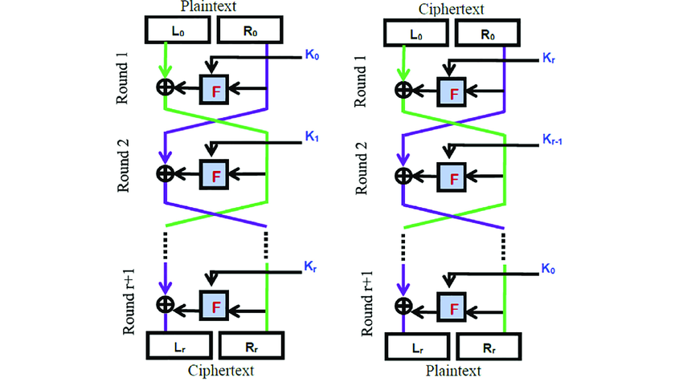

### Feistel block cipher


This package introduces a novel implementation of the Feistel cipher.

#### Usage
You need to call the Feistel class first in order to encrypt a message. The constructor takes as argument the plaintext, the keys, the number of rounds, the encryption function, and the mode (encryption or decryption). You need to set the rest of the values to null as they are not needed in the encryption phase.
```
const plaintext = "This cipĥer is hard to break"
const secret = ["secret", "secret", "secret"]
function F(a, b){
    return Array.from(a).reduce((xored, c, idx) => xored + String.fromCharCode(c.charCodeAt(0) ^ b.charCodeAt(idx)), '')

}
const rounds = 2;
```

```
const feistel = new feistelcipher.Feistel(plaintext, secret, rounds, F, true, null, null, null) 
const result = feistel.encrypt()
const L = result[0][0]
const R = result[0][1]
const spaces = result[1]
```
The result contains the cipher text along with the indices of the spaces in the original message.

The cipher text is divided into two parts L and R.

To decrypt a cipher text, you need to create a new Feistel instance and pass to it the same parameters as in the encryption phase except that you need to set the plaintext to null, the encryption mode to false, and the encryption results i.e. L, R, and the indices of spaces in the original message.

```
const fs_2 = new feistelcipher.Feistel(null,secret, rounds, F , false, L, R, spaces) 
var plaintext_without_spaces= fs_2.decrypt();
var plaintext = fs_2.reconstruct(plaintext_without_spaces)
```

### License
MIT
### Author
Louai Zaiter 2025